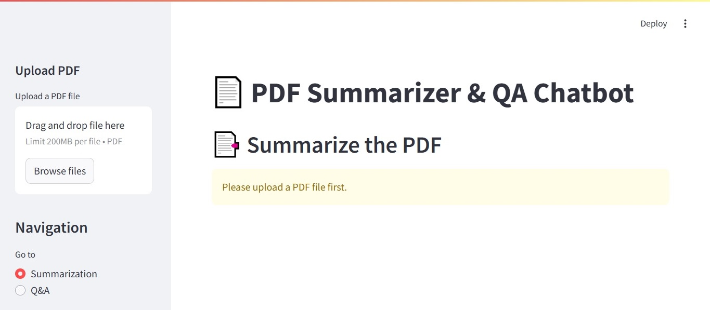

# PDF Summarization & QA Web App

## 📌 Overview
This project is a **FastAPI and Streamlit-based web application** that allows users to:
- **Summarize PDF documents** using an LLM-powered summarization model.
- **Ask questions** about the content of a PDF and receive relevant answers.

## 🚀 Features
- Upload a **PDF document** (one-time upload for both summarization and QA).
- Generate **different summaries** every time you run summarization.
- Perform **detailed summarization** for more insightful results.
- Ask **questions related to the PDF** and get precise answers.
- Uses **LangChain**, **Hugging Face embeddings**, and **FAISS** for retrieval.
- Frontend built with **Streamlit** for a smooth user experience.

---

## 🛠️ Tech Stack
- **Backend:** FastAPI, LangChain, Groq API, FAISS, Hugging Face embeddings
- **Frontend:** Streamlit
- **PDF Processing:** PyPDFLoader

---

## 🏗️ Installation & Setup
### **Clone the Repository**
```sh
git clone https://github.com/renaldiangsar/PDF-Summarizer-QA.git
cd PDF-Summarizer-QA
```

### **Create a Virtual Environment & Install Dependencies**
```sh
# open command prompt and run
python -m venv venv
source venv/bin/activate  # On Windows: venv\Scripts\activate
pip install -r requirements.txt
```

### **Run the Backend (FastAPI)**
```sh
# open command prompt and run
uvicorn serve:app --reload # or just
# python serve.py
```
> The FastAPI server will start at `http://127.0.0.1:8000`

### **Run the Frontend (Streamlit)**
```sh
# open command prompt and run
streamlit run client.py
```
> The Streamlit app will open in your browser at `http://localhost:8501`

### Don't forget to give your api in .env file
- open .env file an set your groq and huggingface api

---

## 🔄 Workflow (How it Works?)
1️. **User uploads a PDF** (file is stored temporarily).
2️. **User selects:**
   - "Summarize" → Calls FastAPI `/summarize/` endpoint to generate a summary.
   - "Ask a Question" → Calls `/ask/` endpoint with the query to get a response.
3️. **FastAPI processes the request** using:
   - LangChain for text processing
   - FAISS for document retrieval (for QA)
   - Groq / Hugging Face models for LLM responses
4️. **Response is displayed** on the Streamlit UI.

---

## 🛠️ Customization & Improvements
- Modify the **summarization prompt** in `serve.py` to change summary length/detail. Because shorter summarization will run faster.
- Adjust the **chunk size** in `RecursiveCharacterTextSplitter` for better retrieval.
- Use a **different LLM model** (e.g., GPT-4, LLaMA, or local models) for customization.
- If you want to do a lot of use, you can use paid Openai API.

---

## 📝 Future Enhancements
- Add **multilingual support** for summarization & QA.
- Implement **document summarization history**.
- Support **multiple PDFs at once**.
- Looking better option to PDF processing, because PyPDFLoader not give a optimal results for unclean/irregular pdfs

---

## Visual


---

This is my first project in github, there are still many shortcomings. I hope i can do better in my next project. 🎉